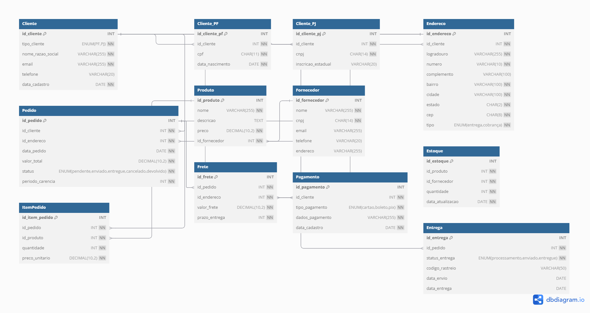

# **E-commerce Database Project**

## **Sobre o Projeto**

Este repositório contém o desenvolvimento de um **banco de dados relacional** para um sistema de e-commerce. O projeto foi criado como parte de um desafio prático em um bootcamp, mas também serve como uma demonstração prática das minhas habilidades em **modelagem de banco de dados**, **lógica de programação** e **resolução de problemas**.

O objetivo principal é criar um sistema robusto que atenda às necessidades de um e-commerce moderno, incluindo funcionalidades como cadastro de clientes (PF/PJ), gerenciamento de estoque, processamento de pedidos, controle de pagamentos e rastreamento de entregas. Além disso, o projeto foi desenvolvido com foco na **sustentabilidade** e no impacto social, alinhando-se aos **Objetivos de Desenvolvimento Sustentável (ODS)** da ONU.



---

## **Por que este projeto é relevante?**

Para recrutadores, este projeto demonstra minha capacidade de:

1. **Modelagem de Dados**: Criação de um esquema de banco de dados eficiente e escalável, com tabelas normalizadas e relacionamentos bem definidos.
2. **Resolução de Problemas**: Implementação de soluções para cenários complexos, como a distinção entre clientes PF/PJ, múltiplas formas de pagamento e status de entrega.
3. **Foco em Sustentabilidade**: Integração dos princípios dos **ODS** (como Consumo e Produção Responsáveis) no design do banco de dados.
4. **Colaboração e Comunicação**: Documentação clara e organizada, facilitando a compreensão do projeto por outros desenvolvedores ou stakeholders.

---

## **Funcionalidades Implementadas**

O banco de dados foi projetado para atender às seguintes funcionalidades:

1. **Cadastro de Clientes**:
   - Suporte a clientes **Pessoa Física (PF)** e **Pessoa Jurídica (PJ)**.
   - Cadastro de múltiplos endereços por cliente (entrega e cobrança).

2. **Gerenciamento de Pedidos**:
   - Um cliente pode realizar vários pedidos.
   - Cada pedido pode conter um ou mais produtos.
   - Status de entrega e código de rastreio.

3. **Pagamentos**:
   - Suporte a várias formas de pagamento (cartão, boleto, PIX).
   - Histórico de pagamentos por cliente.

4. **Estoque e Fornecedores**:
   - Controle de estoque por fornecedor.
   - Atualização automática do estoque ao confirmar um pedido.

5. **Frete e Entregas**:
   - Cálculo de frete baseado no endereço do cliente.
   - Status de entrega e prazo estimado.

6. **Sustentabilidade**:
   - Campos adicionais para monitorar produtos sustentáveis ou ecológicos.
   - Registro de impactos ambientais nas entregas.

---

## **Estrutura do Projeto**
ecommerce-db/
├── README.md # Documentação do projeto
├── sql/ # Scripts SQL
│ ├── create_tables.sql # Script para criar as tabelas
│ ├── insert_data.sql # Script para inserir dados de exemplo
│ └── queries.sql # Exemplos de consultas úteis
├── docs/ # Documentação adicional
│ └── ecommerce.png # Diagrama ERD do banco de dados
└── .gitignore # Arquivos ignorados pelo Git


---

## **Como Executar o Projeto**

1. **Pré-requisitos**:
   - MySQL ou outro SGBD compatível instalado.
   - Ferramenta para execução de scripts SQL (ex.: MySQL Workbench, VS Code com extensão SQLTools).

2. **Passos**:
   - Clone este repositório:
     ```bash
     git clone https://github.com/couto-diego/ecommerce-db.git
     ```
   - Execute o script `create_tables.sql` para criar as tabelas.
   - Insira dados de exemplo usando o script `insert_data.sql`.
   - Teste consultas usando o script `queries.sql`.

---

## **Exemplo de Consultas Úteis**

1. **Listar todos os clientes PF**:
   ```sql
   SELECT c.nome_razao_social, pf.cpf, pf.data_nascimento
   FROM Cliente c
   JOIN Cliente_PF pf ON c.id_cliente = pf.id_cliente;

2. **Calcular o valor total de um pedido, incluindo frete**:
   ````sql
   SELECT SUM(ip.quantidade * ip.preco_unitario) + f.valor_frete AS total
   FROM ItemPedido ip
   JOIN Frete f ON ip.id_pedido = f.id_pedido
   WHERE ip.id_pedido = 10;

3. **Verificar o estoque de um produto**:
   ````sql
   SELECT e.quantidade
   FROM Estoque e
   WHERE e.id_produto = 5;

---

# **Conexão com os Objetivos de Desenvolvimento Sustentável (ODS)**
Este projeto foi desenvolvido com foco nos seguintes ODS:

### ODS 8 - Trabalho Decente e Crescimento Econômico :
Facilita o acesso a produtos e serviços, promovendo o crescimento econômico e a inclusão financeira.
### ODS 9 - Indústria, Inovação e Infraestrutura :
Demonstra inovação tecnológica na criação de uma infraestrutura digital para e-commerce.
### ODS 12 - Consumo e Produção Responsáveis :
Inclui campos para monitorar produtos sustentáveis e reduzir o impacto ambiental das entregas.

---

# **Habilidades Demonstradas**
Este projeto reflete minhas principais competências:

### Linguagens e Ferramentas :
SQL, MySQL, Git/GitHub, VS Code.
### Soft Skills :
Capacidade de análise crítica, resolução de problemas e documentação clara.
### Foco em Resultados :
Entrega de soluções práticas e escaláveis que podem ser aplicadas em cenários reais.

---

